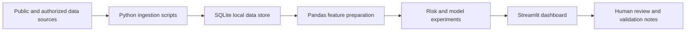

# Market Data Dashboard Docs

Public documentation shell for a private market-data analytics dashboard.

The private implementation is a local Python and Streamlit workspace for exploring market-data ingestion, time-series visualization, basic risk metrics, and prototype model validation. The implementation repository stays private because it contains live runtime scripts, local databases, broker/API integration surfaces, webhook code, Discord automation, and active workbench changes.

This repository explains the project at a recruiter-safe level without exposing private source code, credentials, token files, local machine paths, live trading workflows, or account-specific data.

## Recruiter Snapshot

This project demonstrates:

- Python analytics workflow design.
- Streamlit dashboarding for financial time-series data.
- SQLite-backed local data organization.
- Practical risk and volatility calculations.
- Prototype model evaluation with clear validation boundaries.
- Documentation discipline around what is public, private, and still experimental.

The public framing is market-data analytics and financial-data exploration. It is not presented as a production trading system or professional quant platform.

## Related Public Proof Shells

This repository supports the broader market-data / quant-adjacent analytics story. It should be read alongside the primary Institutional Market Data Engine proof shell and the QuantStrat ML research docs. Private implementation repos, credentialed source access, local databases, broker/API state, and production runtime state are intentionally not linked publicly.

- [Portfolio project page](https://www.michaelspanico.com/projects/institutional-market-data-engine)
- [Market & Quant Analytics Lab Docs](https://github.com/mp2123/Market-Quant-Analytics-Lab-Docs)
- [Institutional Market Data Engine Docs](https://github.com/mp2123/Institutional-Market-Data-Engine-Docs)
- [QuantStrat ML Docs](https://github.com/mp2123/QuantStrat-ML-Docs)
- [Portfolio Website Docs](https://github.com/mp2123/Portfolio-Website-Docs)

## What The Private Dashboard Explores

- Price and volume views for watchlist-level market data.
- Structural indicators such as VWAP, standard-deviation bands, and market breadth.
- Basic risk metrics such as drawdown, volatility, correlation, and Sharpe-style summaries.
- Exploratory predictive models and clustering prototypes for regime-style analysis.
- Backtesting and rules-engine experiments with documented look-ahead-bias controls.
- Public-data and local-data ingestion patterns for repeatable analytics.

## Architecture

## Public vs. Private Boundary

This public docs shell may include:

- Architecture summaries.
- Sanitized diagrams.
- Recruiter-facing project explanation.
- Public-safe screenshots using mock or synthetic data after review.
- Validation and privacy notes.

This public docs shell must not include:

- Private source code from the implementation repo.
- `.env` files, API keys, OAuth tokens, webhook secrets, or broker credentials.
- SQLite databases or exported runtime artifacts.
- Discord, webhook, Screenpipe, broker, or local automation payloads.
- Local machine paths, private watchlists, account-specific data, or trading logs.
- Language implying a live trading system, broker automation, or professional quant production platform.

## Validation Approach

The private project should only be discussed publicly after checks such as:

- current-tree secret and path scan;
- README and screenshot privacy review;
- dashboard smoke check with public or synthetic data;
- model-language review to separate prototypes from production claims;
- GitHub visibility check so implementation remains private.

## Resume Relevance

The project supports Michael Panico's public positioning around:

- business analytics;
- financial-data analytics;
- market-data analytics;
- Python and SQL-style data workflows;
- dashboarding and validation discipline;
- quant-adjacent analytics as a developing area of interest.

The project should not be used to claim current professional experience as a quant trader, quant developer, or professional quant researcher.
